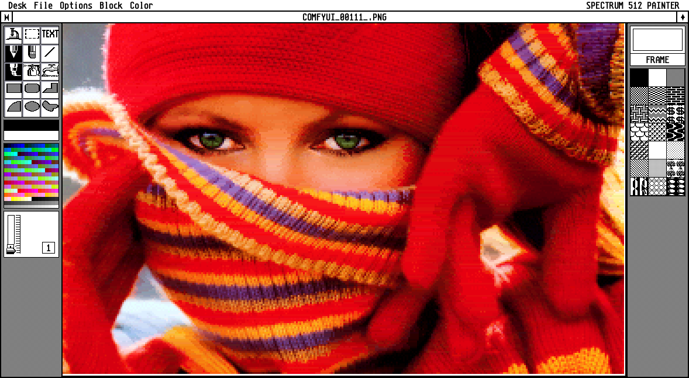

# Spectrum 512 Painter

A classic GEM-style paint program for Atari ST workflows, implemented with HTML5 Canvas/WebGL and ES modules.

Try it online: [https://painter.anides.de/](https://painter.anides.de/)



## Current State (March 3, 2026)

The project is actively usable for painting and Spectrum 512 conversion work.

### Implemented

- File I/O
  - Open: `.SPU`, `.IMG` (including XIMG palette blocks), and common browser image formats.
  - Save and Save As: `.SPU`.
  - Export: `.PNG`.
- GEM IMG decoding
  - Indexed planes: `1..8`.
  - True-color pseudo-plane variants: `16` (5:6:5) and `24` (8:8:8).
  - Documented scanline RLE items and vertical replication marker.
- Spectrum conversion pipeline
  - Toggle: `Color -> Spectrum 512 On/Off`.
  - Targets: `512 (ST)`, `4096 (STE)`, `32768 (STE Enhanced)`.
  - Dither presets: Checks (Error Pair), Floyd-Steinberg, Floyd-Steinberg (85%), Floyd-Steinberg (75%), Floyd-Steinberg (50%), False Floyd-Steinberg.
  - Optimizer toggle: `Options -> Brute-Force Shader On/Off` (WebGL2 path with CPU fallback when unavailable).
- Canvas and viewport
  - Default document is a white `320x200` canvas.
  - GEM-style custom scrollbars (buttons, track paging, thumb drag, wheel scrolling).
  - In Spectrum mode, imported images are normalized to the Spectrum canvas size.
- Active tools
  - `Pencil` (pixel toggle draw, Shift-constrained line).
  - `Freehand` (pattern brush, line-size aware, Shift-constrained line).
  - `Eraser` (double-click clears visible viewport).
  - `Line` (Shift constrains to 45-degree steps).
  - `Fill` (pattern flood fill).
  - `Spray`.
  - `Faucet` (eyedropper; `Alt` sets background color).
  - `Rectangle`, `Rounded Rectangle`, `Ellipse`, `Polygon` (outline and fill mode).
  - `Pie Slice` (outline).
- Palette and paint controls
  - 256-color GEM-style palette with foreground/background swatches.
  - 21 built-in pattern tiles.
  - Line size slider (`1..8`).
  - Shape mode toggle (`FRAME` / `FILL`).

### Not Implemented Yet

- Toolbox icons present but currently no-op: `Zoom`, `Marquee`, `Text`.
- Many menu entries are placeholders (for example Undo, selection operations, palette load/save, image dialogs).
- Menu shortcut labels are mostly visual and not globally wired as keyboard shortcuts.

## Run Locally

1. Open a terminal in this folder.
2. Start a local server, for example:
   ```bash
   python3 -m http.server 8000
   ```
   On Windows, `python -m http.server 8000` also works.
3. Open [http://localhost:8000](http://localhost:8000).

## Project Notes

- No framework/CDN runtime dependencies are required.
- Spectrum conversion logic and UI/tooling are split into dedicated ES module areas under `js/` (`ui`, `canvas`, `io`, `tools`, `imaging`, `formats`, `config`).
- Reference docs are in `doc/`:
  - `CLASSIC_GUI_GUIDELINES.md`
  - `CLASSIC_SCROLLBAR_BEHAVIOR.md`
  - `GEM_Raster_IMG_Format.md`
